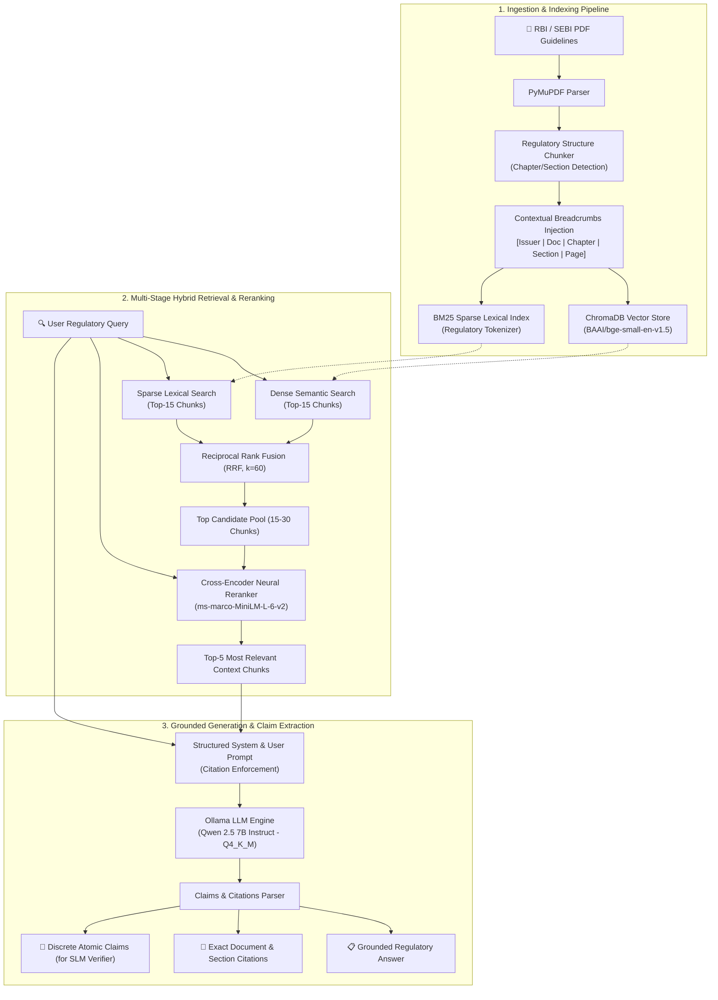

# 🏛️ RBI & SEBI Financial Regulatory RAG Module (Qwen-2.5 Edition)

[](https://www.python.org/)
[](https://ollama.com/library/qwen2.5)
[](https://www.trychroma.com/)
[](https://huggingface.co/BAAI/bge-small-en-v1.5)
[](https://huggingface.co/cross-encoder/ms-marco-MiniLM-L-6-v2)
[](https://pytest.org/)

An enterprise-grade, domain-specific **Retrieval-Augmented Generation (RAG)** pipeline engineered specifically for **Indian Financial Regulations** issued by the **Reserve Bank of India (RBI)** and the **Securities and Exchange Board of India (SEBI)** (Master Directions, Circulars, Notifications, and Guidelines).

The system integrates **structure-aware hierarchical document chunking**, **hybrid dual-channel retrieval** (Dense Semantic Vectors + Sparse BM25 Lexical Tokens), **Reciprocal Rank Fusion (RRF)**, **Cross-Encoder deep neural reranking**, and local inference powered by **Qwen 2.5 (7B Instruct)** with atomic **discrete claim extraction** for downstream verification.

---

## 📑 Table of Contents
- [✨ Key Features](#-key-features)
- [🛠️ Full Tech Stack](#️-full-tech-stack)
- [🏗️ System Architecture](#️-system-architecture)
- [🔬 Deep Technical Specifications](#-deep-technical-specifications)
  - [1. Ingestion & Document Parsing](#1-ingestion--document-parsing)
  - [2. Structure-Aware Chunking & Breadcrumbs](#2-structure-aware-chunking--breadcrumbs)
  - [3. Dual-Channel Indexing](#3-dual-channel-indexing)
  - [4. Hybrid Retrieval & Reciprocal Rank Fusion (RRF)](#4-hybrid-retrieval--reciprocal-rank-fusion-rrf)
  - [5. Cross-Encoder Neural Reranking](#5-cross-encoder-neural-reranking)
  - [6. Qwen 2.5 Generation & Claims Extraction](#6-qwen-25-generation--claims-extraction)
  - [7. Benchmark Evaluation Framework](#7-benchmark-evaluation-framework)
- [💻 Hardware & Resource Specifications](#-hardware--resource-specifications)
- [🚀 Quickstart & Installation](#-quickstart--installation)
  - [Prerequisites](#prerequisites)
  - [Installation Steps](#installation-steps)
  - [Ollama Model Setup](#ollama-model-setup)
- [📖 CLI & Pipeline Usage](#-cli--pipeline-usage)
  - [1. Ingestion & Indexing](#1-ingestion--indexing)
  - [2. Interactive Querying](#2-interactive-querying)
  - [3. Automated Benchmark Evaluation](#3-automated-benchmark-evaluation)
  - [4. Running Unit & Pipeline Tests](#4-running-unit--pipeline-tests)
  - [5. Interactive Jupyter Notebook](#5-interactive-jupyter-notebook)
- [📊 Sample Input / Output Pipeline Trace](#-sample-input--output-pipeline-trace)
- [📁 Repository Structure](#-repository-structure)

---

## ✨ Key Features

- **🏛️ Regulatory Hierarchy Preservation**: Preserves master circular chapters, sections, sub-clauses, circular references (e.g., `RBI/2023-24/...`), and dates by injecting context breadcrumbs directly into text chunks.
- **⚡ Dual-Channel Hybrid Search**: Combines semantic embeddings with custom tokenized BM25 lexical search (preserving regulatory acronyms, section numbers, and percentages).
- **🎯 Reciprocal Rank Fusion (RRF)**: Merges dense semantic hits ($K=15$) and sparse lexical hits ($K=15$) into an optimal candidate pool ($k=60$).
- **🔥 Deep Cross-Encoder Reranking**: Re-scores candidate pairs using `ms-marco-MiniLM-L-6-v2` cross-attention to pass only top-$5$ high-relevance chunks to the LLM.
- **🤖 Qwen 2.5 7B Generation**: Utilizes Alibaba Cloud's state-of-the-art `qwen2.5:7b-instruct-q4_K_M` via Ollama for grounded regulatory reasoning.
- **🛡️ Discrete Atomic Claims Output**: Extracts structured bullet assertions (`DISCRETE_CLAIMS:`) and strict section citations (`[Doc (Year), Section]`) to facilitate automated Small Language Model (SLM) verification.
- **📈 Automated RAG Evaluation**: Built-in metrics computation for Hit Rate@K, Mean Reciprocal Rank (MRR@K), Precision@K, and Citation Coverage.

---

## 🛠️ Full Tech Stack

| Layer | Technology / Component | Specification / Hyperparameters | Rationale & Function |
| :--- | :--- | :--- | :--- |
| **LLM Engine** | **Qwen 2.5 (7B Instruct)** | `qwen2.5:7b-instruct-q4_K_M` (4-bit quantized) | High-precision reasoning, strict prompt compliance, concise regulatory summarization. |
| **Local LLM Runtime** | **Ollama** | `http://localhost:11434`, Context Window: 4096, Temp: 0.1 | Low-latency local inference on CPU/GPU without external API dependency or data leakage. |
| **Dense Embeddings** | **BAAI/bge-small-en-v1.5** | 384 dimensions, Cosine similarity metric | Top-tier MTEB benchmark performance, lightweight CPU inference, dense semantic matching. |
| **Vector Database** | **ChromaDB** | HNSW Index (`hnsw:space: cosine`), Persistent Client | Local vector persistence under `.chroma_db`, metadata filtering, fast batch upsert. |
| **Sparse Lexical Engine** | **Rank-BM25 (BM25Okapi)** | Custom regex tokenizer (`\b[A-Za-z0-9\-\.\/\%]+\b`) | Exact matching for circular IDs, clauses, statutory ratios, and financial percentages. |
| **Ranking & Fusion** | **Reciprocal Rank Fusion (RRF)** | $RRF(d) = \sum \frac{1}{k + r_m(d)}$, $k=60$ | Non-parametric fusion balancing semantic similarity and exact statutory matching. |
| **Neural Reranker** | **Cross-Encoder MiniLM** | `cross-encoder/ms-marco-MiniLM-L-6-v2` (Device: CPU/CUDA) | Full cross-attention query-document interaction; filters false positives from top-30 to top-5. |
| **PDF Extraction Engine** | **PyMuPDF (`fitz`)** | Page-level stream parsing, header/footer cleaning | High-fidelity extraction of complex multi-column legal texts and regulatory tables. |
| **Document Chunking** | **Custom Structure-Aware Chunker** | Target: 600 words, Overlap: 100 words, Max: 1000 words | Regex-based section and chapter boundaries with dynamic contextual metadata breadcrumb headers. |
| **Verification / Parsing** | **Regex & Pydantic** | Claims parsing & citation extraction | Extracts atomic factual statements for auditability and verification. |
| **Evaluation Suite** | **Custom RAG Benchmark** | Hit Rate@5, MRR@5, Precision@5, Citation Rate | End-to-end quantitative validation against ground-truth queries. |
| **Testing & Quality** | **PyTest & Unittest** | Comprehensive automated pipeline test suite | Unit tests for chunker, BM25, vector store, and generator. |

---

## 🏗️ System Architecture



---

## 🔬 Deep Technical Specifications

### 1. Ingestion & Document Parsing
- **Scanner (`DatasetScanner`)**: Scans `RBI-GUIDELINES/` directory, extracts metadata (filename, file size, issuer: RBI/SEBI, document title, regulation category, publication year).
- **Parser (`RegulatoryPDFParser`)**: Utilizes `PyMuPDF` to stream page-by-page text, strip recurrent running headers/footers, and preserve tabular formatting.

### 2. Structure-Aware Chunking & Breadcrumbs
- **Hierarchy Detection**:
  - Chapter RegEx: `^(chapter|part)\s+([IVXLCDM\d]+[:\.\-]?.*)`
  - Section RegEx: `^(\d+[\.\d]*\s+[A-Z].*|section\s+\d+.*|paragraph\s+\d+.*)`
- **Contextual Breadcrumb Injection**: Every chunk is prefixed with a metadata header:
  ```text
  [Issuer: RBI | Category: Master Circular | Year: 2024 | Doc: KYC_Directions | Chapter: Chapter III | Section: Customer Identification Procedure | Page: 12]
  ```
- **Chunk Parameters**:
  - `TARGET_CHUNK_SIZE`: **600 words**
  - `CHUNK_OVERLAP`: **100 words** (last 3 lines boundary retention)
  - `MAX_CHUNK_SIZE`: **1000 words** ceiling

### 3. Dual-Channel Indexing
- **Dense Vector Store (`ChromaVectorStore`)**:
  - Embedding Model: `BAAI/bge-small-en-v1.5` (384-dimensional dense vectors).
  - Distance Metric: Cosine Distance via HNSW index.
  - Query Prefix: `"Represent this sentence for searching relevant passages: "` for asymmetric search.
- **Sparse BM25 Index (`BM25Retriever`)**:
  - Algorithm: `BM25Okapi` ($k_1=1.5, b=0.75$).
  - Regulatory Tokenizer: Preserves complex circular references like `DOR.AML.REC.48/14.01.001/2023-24`, clauses `Section 35A`, and monetary/statutory percentages `4.50%`.

### 4. Hybrid Retrieval & Reciprocal Rank Fusion (RRF)
- Queries execute in parallel across dense and sparse retrievers:
  - Dense candidate count: **15 hits**
  - Sparse candidate count: **15 hits**
- Fusion Score:
  $$\text{RRF Score}(d) = \sum_{m \in \{\text{Dense}, \text{Sparse}\}} \frac{1}{k + r_m(d)}$$
  Where $k = 60$ and $r_m(d)$ is the 1-based rank of document $d$ in retriever $m$.

### 5. Cross-Encoder Neural Reranking
- **Model**: `cross-encoder/ms-marco-MiniLM-L-6-v2`
- **Mechanism**: Evaluates full cross-attention over query-document token pairs $[q, d]$, producing direct relevance logits:
  $$s_{\text{rerank}} = \text{CrossEncoder}([\text{Query}, \text{Chunk Text}])$$
- **Output**: Sorts candidates and filters from top-30 candidate pool down to the **top-5** context passages passed to the LLM.

### 6. Qwen 2.5 Generation & Claims Extraction
- **Model Variant**: `qwen2.5:7b-instruct-q4_K_M` (7 Billion parameters, 4-bit Medium Quantization).
- **Runtime Parameters**:
  - `temperature`: `0.1` (deterministic, grounded output)
  - `num_ctx`: `4096` tokens
  - `timeout`: `180s`
- **Structured System Prompt**:
  ```text
  You are an expert RBI and SEBI financial regulatory compliance officer.
  Answer the user's question using ONLY the provided regulatory context snippets.
  You must cite document names, sections, or clauses.
  At the end of your response, output a section titled 'DISCRETE_CLAIMS:' listing
  each factual assertion as an atomic bullet point for validation by an SLM verifier.
  ```
- **Fallback Engine**: If Ollama is unavailable, an extractive CPU fallback engine synthesizes an answer from the top reranked chunks with extracted claims.

### 7. Benchmark Evaluation Framework
- **Evaluation Dataset**: `data/eval_dataset.json` containing standardized multi-domain regulatory queries.
- **Computed Metrics**:
  - **Hit Rate@K**: Percentage of queries where at least one ground-truth document was retrieved in the top-$K$.
  - **Mean Reciprocal Rank (MRR@K)**: Average reciprocal rank of the first relevant retrieved document: $\text{MRR} = \frac{1}{|Q|} \sum_{i=1}^{|Q|} \frac{1}{\text{rank}_i}$.
  - **Precision@K**: Ratio of relevant retrieved documents in the top-$K$.
  - **Citation Coverage Rate**: Percentage of answers containing valid structural citations.
  - **Avg Claims per Query**: Average number of atomic discrete claims generated.

---

## 💻 Hardware & Resource Specifications

| Resource | Minimum Requirement | Recommended Specification |
| :--- | :--- | :--- |
| **CPU** | 4-Core Intel/AMD x86_64 or Apple Silicon | 8-Core Intel i7/Ryzen 7 / Apple M1/M2/M3 |
| **RAM** | 8 GB System RAM | 16 GB+ System RAM |
| **Storage** | 10 GB free disk space | 20 GB SSD / NVMe |
| **GPU (Optional)** | None (runs fully on CPU) | NVIDIA RTX 3060 / 4060+ (CUDA supported) |
| **Ollama Model Size** | ~4.7 GB (`qwen2.5:7b-instruct-q4_K_M`) | Quantized GGUF in RAM/VRAM |
| **OS** | Windows 10/11, macOS, Ubuntu 20.04+ | Windows 11 / Linux x86_64 |

---

## 🚀 Quickstart & Installation

### Prerequisites
1. **Python 3.10 or higher**: Verify with `python --version`.
2. **Ollama**: Download and install from [ollama.com](https://ollama.com/).

### Installation Steps

```bash
# 1. Clone the repository
git clone https://github.com/LAKSHIYA24/fyp_rag_laks.git
cd FYP_RAG

# 2. Create and activate a virtual environment
python -m venv venv
# On Windows:
.\venv\Scripts\activate
# On Linux/macOS:
source venv/bin/activate

# 3. Install required Python packages
pip install -r requirements.txt
```

### Ollama Model Setup

Start the Ollama server (or ensure the background service is running) and pull the Qwen 2.5 7B model:

```bash
# Pull the default Qwen 2.5 7B Instruct model
ollama pull qwen2.5:7b-instruct-q4_K_M

# (Optional) Pull fallback models if desired
ollama pull phi3.5:latest
```

---

## 📖 CLI & Pipeline Usage

The system exposes a unified command-line interface via [main.py](file:///c:/Users/laksh/Downloads/FYP_RAG/main.py).

### 1. Ingestion & Indexing
Place all regulatory PDF documents in the `RBI-GUIDELINES/` directory and run:

```bash
# Ingest and index all PDF documents
python main.py ingest

# Or test with a small document batch
python main.py ingest --max-docs 10
```

### 2. Interactive Querying
Execute queries against the regulatory knowledge base:

```bash
# Query KYC regulations
python main.py query "What are the KYC compliance guidelines and risk categorization requirements for banks?"

# Query CRR requirements
python main.py query "What is the Cash Reserve Ratio requirement and how is it maintained by banks?"

# Query SEBI regulations
python main.py query "What regulations govern Alternative Investment Funds (AIFs) under SEBI?"
```

### 3. Automated Benchmark Evaluation
Run the built-in evaluation suite over the benchmark queries in `data/eval_dataset.json`:

```bash
python main.py eval
```
*Outputs are printed to the console and serialized to `evaluation_report.json`.*

### 4. Running Unit & Pipeline Tests
Execute the test suite using `pytest`:

```bash
pytest -v
```

### 5. Interactive Jupyter Notebook
For interactive experimentation, step-by-step visualizations, and latency analysis, open:
- [RBI_SEBI_RAG_Qwen.ipynb](file:///c:/Users/laksh/Downloads/FYP_RAG/RBI_SEBI_RAG_Qwen.ipynb)

---

## 📊 Sample Input / Output Pipeline Trace

### Example Query
> *"What is the Cash Reserve Ratio (CRR) requirement and how is it maintained by banks under RBI guidelines?"*

### Pipeline Output

```text
=== REGULATORY QUERY: 'What is the Cash Reserve Ratio (CRR) requirement and how is it maintained by banks?' ===
[VectorStore] Initializing ChromaDB at .chroma_db...
[BM25] Loaded index with 1420 chunks from .bm25_index.pkl
[Reranker] Loading Cross-Encoder reranker: cross-encoder/ms-marco-MiniLM-L-6-v2...
[HybridRetrieval] Retrieved 5 reranked chunks for query: 'What is the Cash Reserve Ratio requirement...'

--- GROUNDED REGULATORY ANSWER ---
Under the RBI Master Directions on Cash Reserve Ratio (CRR) and Statutory Liquidity Ratio (SLR), scheduled commercial banks are mandated to maintain a minimum CRR with the Reserve Bank of India. The CRR is computed as a prescribed percentage of the bank's Net Demand and Time Liabilities (NDTL) under Section 42(1) of the Reserve Bank of India Act, 1934. Banks are required to maintain the prescribed minimum daily balance of CRR on all days of the reporting fortnight to avoid statutory penal interest.

--- SOURCE CITATIONS ---
 - [RBI Master Direction - Cash Reserve Ratio (CRR) (2024), Chapter II - Computation of NDTL and Maintenance]
 - [RBI Master Direction - Reserve Ratios (2023), Section 4 - Penalties on Default]

--- DISCRETE CLAIMS (FOR DOWNSTREAM SLM VERIFIER) ---
 [1] Banks must maintain CRR as a percentage of Net Demand and Time Liabilities (NDTL).
 [2] CRR is mandated under Section 42(1) of the Reserve Bank of India Act, 1934.
 [3] Maintenance of CRR is monitored on a fortnightly reporting cycle.
 [4] Failure to maintain minimum daily balances attracts statutory penal interest.

[Engine Used: qwen2.5:7b-instruct-q4_K_M (Ollama)]
```

---

## 📁 Repository Structure

```
FYP_RAG/
├── README.md                      # Comprehensive system documentation & technical specification
├── config.py                      # Core hyperparameters, model paths, chunking & retrieval constants
├── main.py                        # Unified CLI entry point (ingest, query, eval)
├── requirements.txt               # Production Python dependencies
├── evaluation_report.json         # Serialized benchmark evaluation report
├── RBI_SEBI_RAG_Qwen.ipynb        # Interactive Jupyter Notebook for Qwen 2.5 RAG pipeline
├── RBI_SEBI_RAG_Llama3.ipynb      # Comparative Jupyter Notebook for LLaMA 3 variant
├── data/
│   └── eval_dataset.json          # Standardized benchmark evaluation questions & ground truth
├── tests/
│   └── test_rag_pipeline.py       # Unit and integration test suite
├── RBI-GUIDELINES/                # Target repository directory for regulatory PDF documents
└── rag_module/                    # Modular RAG architecture package
    ├── __init__.py
    ├── ingestion/                 # Document discovery & extraction
    │   ├── __init__.py
    │   ├── dataset_scanner.py     # PDF metadata extraction & batching
    │   └── pdf_parser.py          # PyMuPDF page-level extraction engine
    ├── chunking/                  # Structural text splitting
    │   ├── __init__.py
    │   └── structure_aware_chunker.py # Heading regex parsing & contextual breadcrumb generation
    ├── indexing/                  # Vector persistence
    │   ├── __init__.py
    │   └── vector_store.py        # ChromaDB client & BGE-Small dense embedding pipeline
    ├── retrieval/                 # Multi-stage hybrid search & reranking
    │   ├── __init__.py
    │   ├── bm25_retriever.py      # BM25Okapi sparse index & regulatory tokenizer
    │   └── hybrid_reranker.py     # Reciprocal Rank Fusion (RRF) & Cross-Encoder reranker
    ├── generation/                # LLM synthesis & claim extraction
    │   ├── __init__.py
    │   └── generator.py           # Ollama Qwen 2.5 client, prompt template & claim parser
    └── evaluation/                # Performance measurement
        ├── __init__.py
        └── evaluator.py           # Hit Rate@K, MRR@K, Precision@K, and Citation scoring
```

---

## 📜 License
This project is developed for academic and regulatory compliance research. Distributed under the MIT License.
